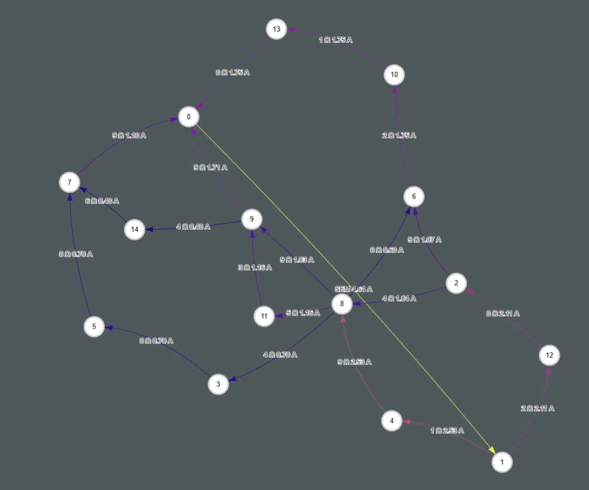
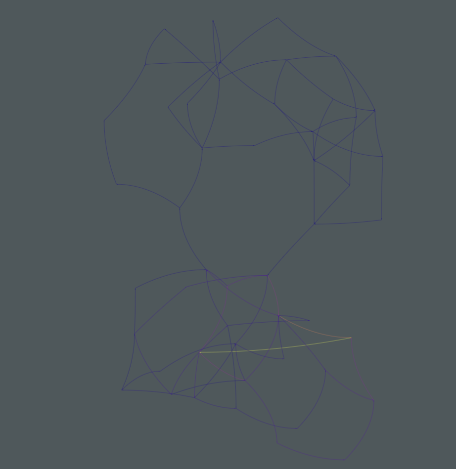
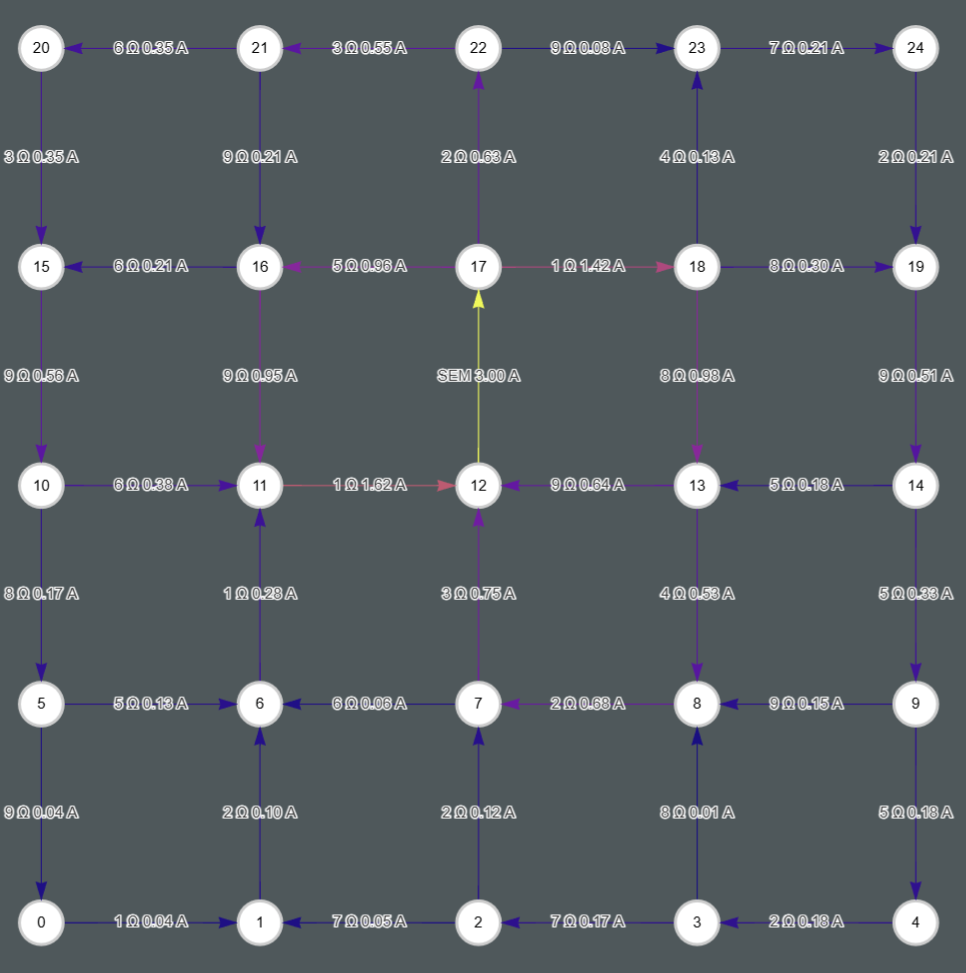
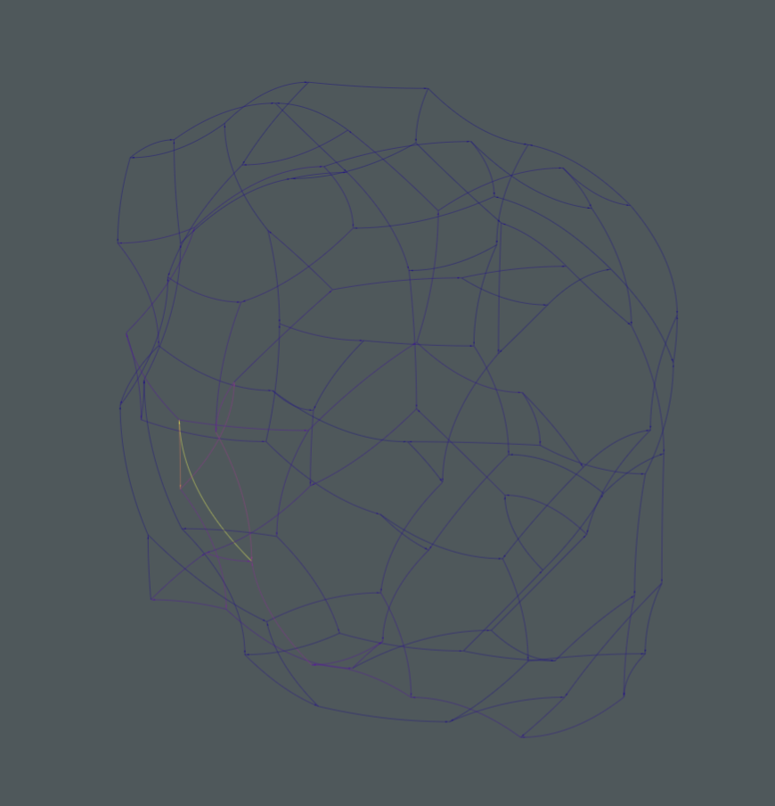
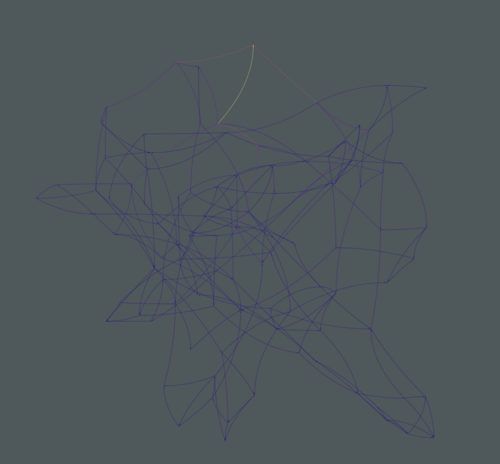

# Electrical Circuit Analysis & Linear Algebra Solvers

## Project Overview
An implementation of numerical methods and circuit analysis algorithms featuring:

- Matrix solving techniques (Gauss-Jordan, LU Factorization)
- Advanced circuit analysis for 5 graph types
- Interactive current flow visualizations
- Performance benchmarking against NumPy

## Core Components

### 1. Linear Algebra Implementations
**Gauss-Jordan Elimination**
- Partial pivoting for numerical stability
- Row operations for matrix diagonalization
- Complexity: O(n³) for n×n matrices

**LU Factorization**
- In-place matrix decomposition
- Lower/Upper triangular reconstruction
- Residual norm verification

### 2. Circuit Analysis Methods
**Supported Graph Types**
| Graph Type         |
|--------------------|
| Erdős-Rényi        |
| Bridge             |
| 2D Grid            |
| 3-Regular          |
| Small-World        |

**Analysis Techniques**
- Kirchhoff's Laws
- Nodal Voltage Method 

## Visualization Gallery

### Erdős-Rényi Random Graph

### Bridge Configuration

### Regular Grid

### 3-Regular Graph

### Small-World Network

